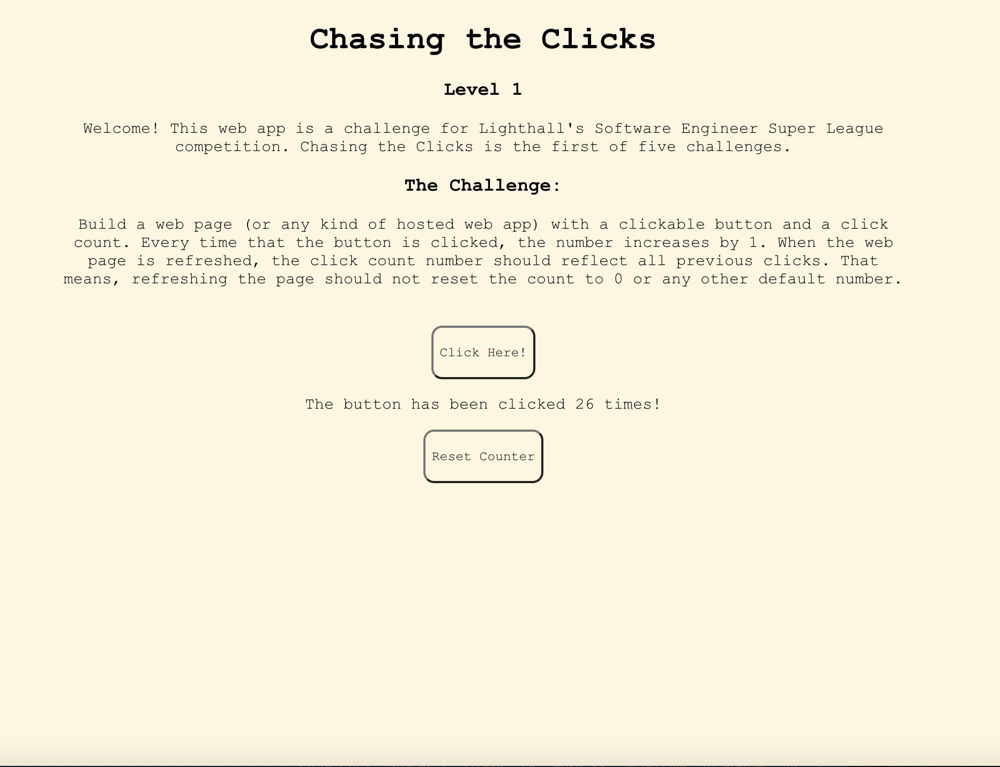

# Chasing the Clicks

Chasing the Clicks is my submission to Lighthall's Software Engineering Super League competition. 

[Click here to check it out!](https://dev.d1chr4hycvmc44.amplifyapp.com/)

## The Challenge
Chasing the Clicks is the first level of five within the competition. Participants were tasked with:
    * creating a hosted web app
    * with a clickable button and click count
    * everytime the button is clicked, the count increases by one
    * when the web app is refreshed, the click count number should reflect previous clicks

## Built With
- React.js
- Amplify AWS
- HTML
- CSS

## Author

**Presh Worthy**